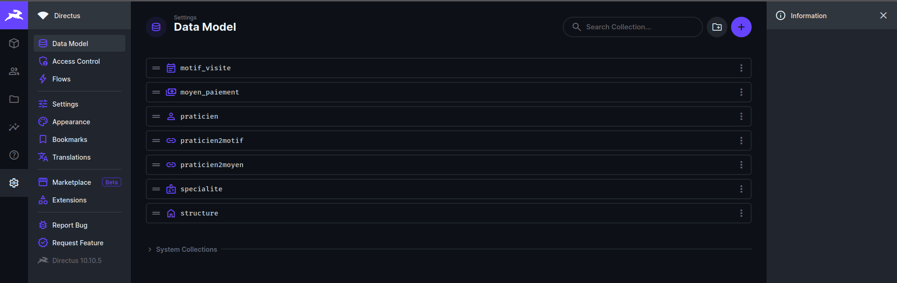
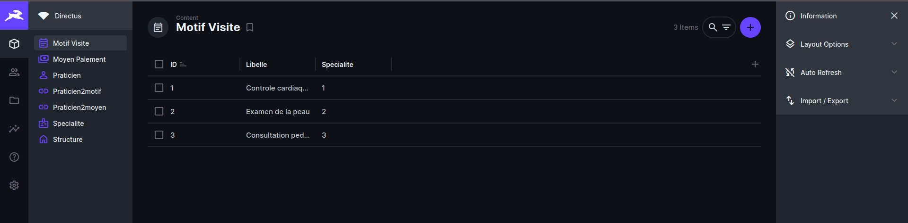
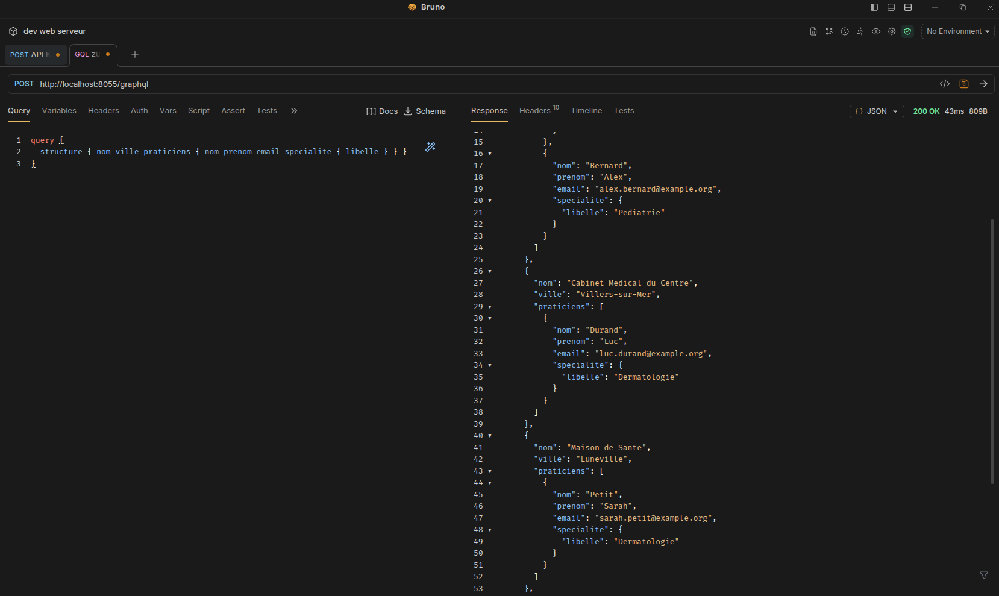

# TD3 - CMS headless Directus - Compte rendu

Auteurs : Carette Robin - Franoux Noé
Depot : https://github.com/CaretteRobin/nouveaux-paradigmes-TD3-4.git

## Introduction
Ce compte rendu presente la mise en place d'un CMS headless avec Directus pour un domaine "praticiens de sante". L'objectif est de construire un backoffice permettant de gerer les donnees, puis de les exposer via l'API REST de Directus. Les captures ecran documentent chaque etape cle et servent de preuves de realisation.

## Objectifs du TD
- Installer Directus en Docker.
- Construire le modele de donnees (collections + relations).
- Importer un jeu de donnees (CSV) en respectant l'ordre des dependances.
- Verifier les donnees via le backoffice.
- Consommer l'API REST pour obtenir des donnees simples et imbriquees.

## Environnement et demarrage
Le service est deploye avec Docker Compose. Le conteneur Directus est expose sur le port 8055.

{ width=90% }

Ce terminal montre le lancement via `docker compose up -d` puis la verification avec `docker ps`. On constate que Directus est actif (port 8055) ainsi que la base de donnees. Une tentative initiale a signale un daemon Docker non disponible, puis le demarrage a reussi.

## Modele de donnees
Le modele suit le schema du domaine "praticiens de sante". Les collections principales sont :
- `praticien`
- `specialite`
- `structure`
- `motif_visite`
- `moyen_paiement`
- tables de jonction `praticien2motif` et `praticien2moyen`

{ width=90% }

Cette vue liste toutes les collections definies dans Directus, confirmant l'existence du modele complet et la preparation des relations.

{ width=90% }

Les champs principaux du praticien sont visibles, ainsi que les relations vers `specialite` et `structure`. Cela valide la modelisation M2O attendue.

## Chargement des donnees (CSV)
Les donnees sont importees depuis des fichiers CSV avec separateur `;` afin de reprendre un jeu existant.

{ width=90% }

L'extrait montre les colonnes attendues (nom, prenom, ville, email, telephone, etc.) et les cles d'association (specialite, structure). Cela garantit la compatibilite avec les relations du modele.

{ width=90% }

La liste des praticiens confirme que l'import a ete effectue correctement et que les enregistrements sont consultables dans l'interface.

## Verification dans le backoffice
Apres import, les collections sont consultables et navigables directement via l'interface.

{ width=90% }

Cet ecran illustre l'acces aux collections et aux items, confirmant la disponibilite des donnees dans le backoffice.

## API REST (exposition des donnees)
Base URL (exemple local) : `http://localhost:8055`

Si un token est utilise :
```
Authorization: Bearer <TOKEN>
```

Requetes REST realisees (conformes aux exigences du TD) :

1) Liste des praticiens
```bash
curl -H "Authorization: Bearer <TOKEN>" \
  "http://localhost:8055/items/praticien?fields=id,nom,prenom,ville"
```

2) Specialite d'ID 2
```bash
curl -H "Authorization: Bearer <TOKEN>" \
  "http://localhost:8055/items/specialite/2"
```

3) Specialite d'ID 2 avec uniquement le libelle
```bash
curl -H "Authorization: Bearer <TOKEN>" \
  "http://localhost:8055/items/specialite/2?fields=libelle"
```

4) Un praticien avec sa specialite (libelle)
```bash
curl -H "Authorization: Bearer <TOKEN>" \
  "http://localhost:8055/items/praticien/<ID>?fields=nom,prenom,specialite.libelle"
```

5) Une structure (nom, ville) avec la liste de ses praticiens
```bash
curl -H "Authorization: Bearer <TOKEN>" \
  "http://localhost:8055/items/structure/<ID>?fields=nom,ville,praticiens.nom,praticiens.prenom"
```

6) Idem avec le libelle de la specialite des praticiens
```bash
curl -H "Authorization: Bearer <TOKEN>" \
  "http://localhost:8055/items/structure/<ID>?fields=nom,ville,praticiens.nom,praticiens.prenom,praticiens.specialite.libelle"
```

7) Structures dont la ville contient "sur", avec la liste des praticiens
```bash
curl -H "Authorization: Bearer <TOKEN>" \
  "http://localhost:8055/items/structure?filter[ville][_contains]=sur&fields=nom,ville,praticiens.nom,praticiens.prenom,praticiens.specialite.libelle"
```

Ces requetes valident l'exposition REST attendue, la selection de champs (`fields`) pour limiter les donnees retournees et la navigation dans les relations.

## Annexes - Securite et GraphQL (preparation TD4)
Les captures suivantes illustrent des actions realisees en parallele pour preparer l'API GraphQL et les droits d'acces (hors perimetre strict du TD3, mais utiles pour la suite).

{ width=90% }

Creation d'un role dedie avec les droits de lecture sur les collections necessaires. Cela sert a controler l'acces a l'API.

{ width=90% }

Deux comptes sont associes au role : un utilisateur avec token statique et un utilisateur pour JWT, afin de tester l'authentification.

{ width=90% }

Test d'acces sans authentification : la requete echoue, ce qui confirme que les permissions publiques sont bien restreintes.

{ width=90% }

Verification d'une requete GraphQL renvoyant des structures et leurs praticiens avec specialite. Cela valide la navigation dans les relations cote API.

{ width=90% }

Exemple de mutation (creation d'une specialite) en tant qu'admin, pour verifier les operations d'ecriture.

## Conclusion
Le CMS headless Directus a ete deploye avec succes, le modele de donnees a ete construit et alimente via CSV, puis verifie dans le backoffice. L'API REST permet de consommer les donnees avec selection de champs et navigation relationnelle. Les captures annexes montrent en plus la mise en place des roles et l'utilisation de GraphQL pour preparer la suite du projet. L'ensemble constitue un rendu clair, exploitable et conforme aux objectifs du TD.
